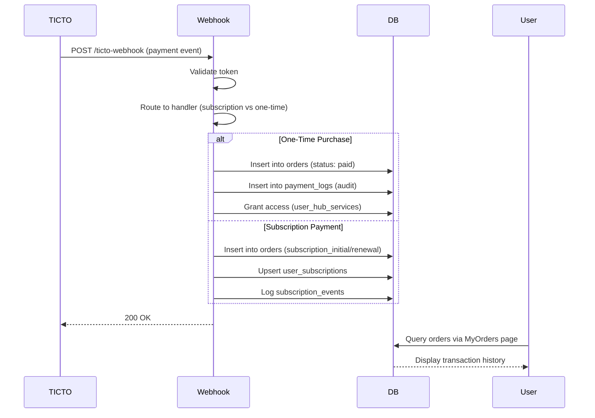

# Sistema de Pedidos (Orders System)

**Versão:** 1.0
**Data:** 2026-02-22
**Autor:** Claude Code

---

## 📋 Índice

1. [Visão Geral](#visão-geral)
2. [Arquitetura](#arquitetura)
3. [Banco de Dados](#banco-de-dados)
4. [Integração com Webhook TICTO](#integração-com-webhook-ticto)
5. [Interface do Usuário](#interface-do-usuário)
6. [Fluxo de Dados](#fluxo-de-dados)
7. [Segurança](#segurança)
8. [Testes](#testes)
9. [Solução de Problemas](#solução-de-problemas)
10. [Manutenção](#manutenção)

---

## 🎯 Visão Geral

O Sistema de Pedidos é uma funcionalidade que permite aos usuários visualizarem seu histórico completo de transações financeiras na plataforma ENP Hub. O sistema rastreia:

- **Compras únicas** de serviços do hub
- **Assinaturas iniciais** de planos (Pro, VIP)
- **Renovações de assinatura** mensais/anuais
- **Reembolsos e cancelamentos**

### Objetivos

- ✅ Fornecer transparência financeira total aos usuários
- ✅ Manter histórico completo de todas as transações
- ✅ Suportar múltiplos métodos de pagamento (PIX, Boleto, Cartão)
- ✅ Facilitar suporte ao cliente com IDs de transação
- ✅ Preparar base para emissão de recibos/notas fiscais

---

## 🏗️ Arquitetura

### Componentes Principais

```
┌─────────────────────────────────────────────────────────┐
│                    TICTO Platform                        │
│                  (Payment Gateway)                       │
└────────────────────┬────────────────────────────────────┘
                     │ Webhook Events
                     ▼
┌─────────────────────────────────────────────────────────┐
│              Supabase Edge Function                      │
│           ticto-webhook/index.ts                        │
│                                                          │
│  ┌──────────────────┐      ┌────────────────────┐      │
│  │  One-Time        │      │  Subscription      │      │
│  │  Purchase        │      │  Handler           │      │
│  │  Handler         │      │  (subscriptionH..) │      │
│  └──────────────────┘      └────────────────────┘      │
└──────────┬────────────────────────┬────────────────────┘
           │                        │
           ▼                        ▼
┌─────────────────────────────────────────────────────────┐
│                   PostgreSQL Database                    │
│                                                          │
│  ┌──────────────┐  ┌──────────────┐  ┌──────────────┐ │
│  │   orders     │  │ payment_logs │  │ user_subscr. │ │
│  │ (user-facing)│  │   (audit)    │  │  (access)    │ │
│  └──────────────┘  └──────────────┘  └──────────────┘ │
└──────────┬──────────────────────────────────────────────┘
           │
           ▼
┌─────────────────────────────────────────────────────────┐
│                   React Frontend                         │
│                                                          │
│  ┌──────────────────────────────────────────────┐      │
│  │  MyOrders.tsx                                 │      │
│  │  - Displays order history                     │      │
│  │  - Currency formatting                        │      │
│  │  - Status badges                              │      │
│  │  - Product type labels                        │      │
│  └──────────────────────────────────────────────┘      │
│                                                          │
│  ┌──────────────────────────────────────────────┐      │
│  │  usePaymentHistory.ts                         │      │
│  │  - React Query hook                           │      │
│  │  - Fetches from orders table                  │      │
│  └──────────────────────────────────────────────┘      │
└─────────────────────────────────────────────────────────┘
```

### Estratégia de Dual Logging

O sistema mantém **duas tabelas** com propósitos diferentes:

| Tabela | Propósito | Dados | Acesso |
|--------|-----------|-------|--------|
| `orders` | **Interface do usuário** | Dados normalizados e amigáveis | Usuários via RLS |
| `payment_logs` | **Auditoria técnica** | Payload completo do webhook | Admins/Service Role |

**Vantagens:**
- `orders`: Otimizada para exibição rápida, campos limpos
- `payment_logs`: Preserva payload original para debugging
- Separação de responsabilidades
- Não quebra sistemas legados que usam `payment_logs`

---

## 💾 Banco de Dados

### Tabela `orders`

**Arquivo:** `supabase/migrations/20260222000000_create_orders_table.sql`

#### Schema

```sql
CREATE TABLE public.orders (
  -- Identificação
  id UUID PRIMARY KEY DEFAULT gen_random_uuid(),

  -- Relacionamentos
  user_id UUID NOT NULL REFERENCES auth.users(id) ON DELETE CASCADE,
  service_id UUID REFERENCES public.hub_services(id) ON DELETE SET NULL,
  plan_id TEXT REFERENCES public.plans(id) ON DELETE SET NULL,
  subscription_id UUID REFERENCES public.user_subscriptions(id) ON DELETE SET NULL,

  -- Informações do Produto
  product_name TEXT NOT NULL,
  product_type TEXT NOT NULL CHECK (product_type IN (
    'one_time_service',
    'subscription_initial',
    'subscription_renewal'
  )),

  -- Informações Financeiras
  amount NUMERIC(10, 2) NOT NULL,  -- Em unidades de moeda (não centavos)
  currency TEXT NOT NULL DEFAULT 'BRL',

  -- Status
  status TEXT NOT NULL DEFAULT 'pending' CHECK (status IN (
    'paid',      -- Pagamento aprovado
    'pending',   -- Aguardando pagamento
    'cancelled', -- Cancelado pelo usuário/sistema
    'refunded'   -- Reembolsado
  )),

  -- Integração TICTO
  ticto_order_id TEXT,       -- order.hash do TICTO
  ticto_transaction_id TEXT,
  ticto_event_type TEXT,     -- Tipo de evento original

  -- Assinaturas
  billing_cycle TEXT CHECK (billing_cycle IS NULL OR billing_cycle IN ('monthly', 'annual')),

  -- Timestamps
  paid_at TIMESTAMPTZ,
  created_at TIMESTAMPTZ NOT NULL DEFAULT now(),
  updated_at TIMESTAMPTZ NOT NULL DEFAULT now()
);
```

#### Índices

```sql
-- Performance indexes
CREATE INDEX idx_orders_user_id ON orders(user_id);
CREATE INDEX idx_orders_service_id ON orders(service_id) WHERE service_id IS NOT NULL;
CREATE INDEX idx_orders_plan_id ON orders(plan_id) WHERE plan_id IS NOT NULL;
CREATE INDEX idx_orders_ticto_order_id ON orders(ticto_order_id) WHERE ticto_order_id IS NOT NULL;
CREATE INDEX idx_orders_status ON orders(status);
CREATE INDEX idx_orders_created_at ON orders(created_at DESC);
CREATE INDEX idx_orders_subscription_id ON orders(subscription_id) WHERE subscription_id IS NOT NULL;
```

#### Políticas RLS

```sql
-- Usuários veem apenas seus próprios pedidos
CREATE POLICY "Users can read own orders"
  ON orders FOR SELECT
  USING (user_id = auth.uid());

-- Admins veem todos os pedidos
CREATE POLICY "Admins can read all orders"
  ON orders FOR SELECT
  USING (has_role(auth.uid(), 'admin'::app_role));
```

### Tipos de Produto

| `product_type` | Descrição | Exemplo |
|----------------|-----------|---------|
| `one_time_service` | Compra única de serviço | Currículo USA, Consultoria |
| `subscription_initial` | Primeiro pagamento de assinatura | Plano Pro (inicial) |
| `subscription_renewal` | Renovação mensal/anual | Plano Pro (renovação) |

### Status Normalizados

| Status | Significado | Eventos TICTO Correspondentes |
|--------|-------------|-------------------------------|
| `paid` | Pagamento aprovado | `paid`, `completed`, `approved`, `authorized`, `venda_realizada` |
| `pending` | Aguardando pagamento | `waiting_payment`, `pix_created`, `bank_slip_created` |
| `cancelled` | Cancelado | `cancelled`, `subscription_canceled` |
| `refunded` | Reembolsado | `refunded`, `chargedback`, `reembolso` |

---

## 🔗 Integração com Webhook TICTO

### Fluxo de Eventos



### Handlers de Webhook

#### 1. One-Time Purchase Handler

**Arquivo:** `supabase/functions/ticto-webhook/index.ts` (linhas 129-233)

**Eventos processados:**
- `paid`, `completed`, `approved`, `authorized`, `venda_realizada`

**Fluxo:**
```typescript
1. Validar email do cliente
2. Buscar perfil do usuário por email
3. Buscar serviço por ticto_product_id
4. Conceder acesso (user_hub_services)
5. Criar registro em orders ✨
6. Logar em payment_logs
```

**Exemplo de código:**
```typescript
const paidAmount = payload.order?.paid_amount || 0;
const amountInCurrency = (paidAmount / 100).toFixed(2); // 9700 → 97.00

await supabase.from("orders").insert({
  user_id: profile.id,
  service_id: service.id,
  product_name: payload.item?.product_name || service.name,
  product_type: "one_time_service",
  amount: parseFloat(amountInCurrency),
  currency: "BRL",
  status: "paid",
  ticto_order_id: transactionId,
  ticto_event_type: eventStatus,
  paid_at: new Date().toISOString(),
});
```

#### 2. Refund Handler

**Arquivo:** `supabase/functions/ticto-webhook/index.ts` (linhas 236-282)

**Eventos processados:**
- `reembolso`, `refunded`, `chargedback`, `cancelled`

**Fluxo:**
```typescript
1. Revogar acesso ao serviço
2. Atualizar status do pedido para 'refunded' ✨
3. Logar em payment_logs
```

#### 3. Subscription Payment Handler

**Arquivo:** `supabase/functions/_shared/subscriptionHandlers.ts`

**Função:** `createSubscriptionOrder()` (linhas 152-209)

**Lógica de detecção de renovação:**
```typescript
// Verifica se usuário já tem assinatura ativa
const { data: existingSub } = await supabase
  .from("user_subscriptions")
  .select("id, status")
  .eq("user_id", userId)
  .in("status", ["active", "past_due", "grace_period"])
  .maybeSingle();

const isRenewal = !!existingSub && existingSub.status === "active";

const product_type = isRenewal
  ? "subscription_renewal"
  : "subscription_initial";
```

**Chamada no `activateSubscription`:**
```typescript
await createSubscriptionOrder(
  profile.id,
  plan.id,
  createdSub?.id || null,
  payload,
  cycle, // 'monthly' ou 'annual'
  supabase
);
```

### Mapeamento de Campos TICTO → Orders

| Campo TICTO | Campo Orders | Transformação |
|-------------|--------------|---------------|
| `order.hash` | `ticto_order_id` | Direto |
| `item.product_name` | `product_name` | Direto ou fallback para service.name |
| `order.paid_amount` | `amount` | `paid_amount / 100` (centavos → BRL) |
| `status` ou `event` | `status` | Normalização (paid/pending/cancelled/refunded) |
| `customer.email` | `user_id` | Lookup em profiles |
| `item.product_id` | `service_id` | Lookup em hub_services |
| `item.offer_id` | `plan_id` | Lookup em plans |

---

## 🖥️ Interface do Usuário

### Página "Meus Pedidos"

**Arquivo:** `src/pages/orders/MyOrders.tsx`

**Rota:** `/meus-pedidos`

**Acesso:** Menu lateral → "MINHA CONTA" → "Meus Pedidos"

#### Componentes Visuais

```tsx
┌─────────────────────────────────────────────────────┐
│ 📄 Meus Pedidos                                     │
│ Acompanhe o histórico de suas compras               │
├─────────────────────────────────────────────────────┤
│                                                      │
│  🛍️  Plano Pro - Mensal          [Mensal]           │
│      21 de fevereiro de 2026 às 14:30              │
│      R$ 97,00 • Assinatura                          │
│      ID: ORD123456789                               │
│                            [Pago] [Acessar →]      │
│                                                      │
│  🛍️  Currículo USA                                  │
│      15 de fevereiro de 2026 às 10:15              │
│      R$ 197,00 • Compra única                       │
│      ID: ORD987654321                               │
│                            [Pago] [Acessar →]      │
│                                                      │
└─────────────────────────────────────────────────────┘
```

#### Funções Helper

**1. Formatação de Moeda**
```typescript
const formatCurrency = (amount: number, currency: string = 'BRL') => {
  return new Intl.NumberFormat('pt-BR', {
    style: 'currency',
    currency: currency,
  }).format(amount);
};

// Exemplo: formatCurrency(97.00, 'BRL') → "R$ 97,00"
```

**2. Status Badges**
```typescript
const getStatusVariant = (status: string) => {
  switch (status) {
    case 'paid':      return 'default';     // Verde (sucesso)
    case 'pending':   return 'secondary';   // Amarelo (aguardando)
    case 'cancelled': return 'outline';     // Cinza (cancelado)
    case 'refunded':  return 'destructive'; // Vermelho (reembolsado)
  }
};

const getStatusLabel = (status: string) => {
  const labels = {
    paid: 'Pago',
    pending: 'Aguardando',
    cancelled: 'Cancelado',
    refunded: 'Reembolsado'
  };
  return labels[status] || 'Pendente';
};
```

**3. Tipo de Produto**
```typescript
const getProductTypeLabel = (type: string) => {
  const labels = {
    one_time_service: 'Compra única',
    subscription_initial: 'Assinatura',
    subscription_renewal: 'Renovação'
  };
  return labels[type] || type;
};
```

### Hook React Query

**Arquivo:** `src/hooks/usePaymentHistory.ts`

```typescript
export function usePaymentHistory(userId?: string) {
  return useQuery({
    queryKey: ['orders', userId],
    queryFn: async () => {
      const { data, error } = await supabase
        .from('orders')
        .select(`
          *,
          service:hub_services(name, route),
          plan:plans(name)
        `)
        .eq('user_id', userId!)
        .order('created_at', { ascending: false });

      if (error) throw error;
      return data as Order[];
    },
    enabled: !!userId,
  });
}
```

**Features:**
- ✅ Cache automático via React Query
- ✅ Refetch on window focus
- ✅ Joins automáticos com serviços e planos
- ✅ Ordenação por data (mais recente primeiro)

---

## 🔄 Fluxo de Dados

### Cenário 1: Compra de Serviço (One-Time)

```
1. Usuário compra "Currículo USA" (R$ 197,00) via TICTO
   ↓
2. TICTO envia webhook: { status: "paid", paid_amount: 19700, ... }
   ↓
3. ticto-webhook/index.ts processa:
   - Valida token
   - Identifica como compra única (product_id)
   - Busca usuário por email
   - Busca serviço por ticto_product_id
   ↓
4. Ações no banco:
   ✅ INSERT INTO user_hub_services (concede acesso)
   ✅ INSERT INTO orders (registro user-facing)
   ✅ INSERT INTO payment_logs (auditoria)
   ↓
5. Usuário acessa "/meus-pedidos"
   ↓
6. Frontend:
   - usePaymentHistory() busca orders
   - Renderiza card com:
     * "Currículo USA"
     * "R$ 197,00 • Compra única"
     * Badge "Pago"
     * Botão "Acessar" → /curriculo
```

### Cenário 2: Assinatura de Plano

```
1. Usuário assina "Plano Pro - Mensal" (R$ 97,00/mês)
   ↓
2. TICTO envia webhook: { status: "paid", offer_id: "123", paid_amount: 9700, ... }
   ↓
3. Roteamento:
   - offer_id corresponde a plans.ticto_offer_id_monthly
   - Roteado para handleSubscriptionEvent()
   ↓
4. activateSubscription() executa:
   ✅ UPSERT INTO user_subscriptions (ativa plano)
   ✅ INSERT INTO orders (product_type: 'subscription_initial')
   ✅ INSERT INTO subscription_events (auditoria)
   ↓
5. Frontend exibe:
   - "Plano Pro - Mensal [Mensal]"
   - "R$ 97,00 • Assinatura"
   - Badge "Pago"
```

### Cenário 3: Renovação de Assinatura

```
1. TICTO cobra renovação automática (30 dias depois)
   ↓
2. Webhook: { status: "paid", offer_id: "123", ... }
   ↓
3. createSubscriptionOrder() detecta:
   - Usuário já possui user_subscriptions.status = 'active'
   - isRenewal = true
   ↓
4. INSERT INTO orders:
   - product_type: 'subscription_renewal'
   - product_name: "Plano Pro - Mensal"
   ↓
5. Frontend exibe NOVO pedido:
   - "Plano Pro - Mensal [Mensal]"
   - "R$ 97,00 • Renovação"
   - Badge "Pago"
```

### Cenário 4: Reembolso

```
1. Admin processa reembolso no TICTO
   ↓
2. Webhook: { status: "refunded", order_hash: "ORD123", ... }
   ↓
3. Refund handler:
   ✅ UPDATE user_hub_services SET status = 'cancelled'
   ✅ UPDATE orders SET status = 'refunded' WHERE ticto_order_id = 'ORD123'
   ✅ INSERT INTO payment_logs
   ↓
4. Frontend atualiza:
   - Badge muda de "Pago" → "Reembolsado" (vermelho)
   - Botão "Acessar" desaparece
```

---

## 🔒 Segurança

### Row Level Security (RLS)

**Política 1: Usuários leem próprios pedidos**
```sql
CREATE POLICY "Users can read own orders"
  ON orders FOR SELECT
  USING (user_id = auth.uid());
```

**Como funciona:**
- Supabase compara `orders.user_id` com o ID do usuário autenticado
- Usuário A nunca vê pedidos do Usuário B
- Queries automáticas filtram por `WHERE user_id = auth.uid()`

**Política 2: Admins leem todos os pedidos**
```sql
CREATE POLICY "Admins can read all orders"
  ON orders FOR SELECT
  USING (has_role(auth.uid(), 'admin'::app_role));
```

**Como funciona:**
- Checa role do usuário em `user_roles`
- Admins têm acesso irrestrito para suporte
- Usado em páginas admin como `/admin/pedidos`

### Proteção do Webhook

**1. Validação de Token**
```typescript
const expectedToken = tictoConfig.credentials.secret_key; // De api_configs
const receivedToken = payload.token || req.headers.get("X-Ticto-Token");

if (receivedToken !== expectedToken) {
  return new Response(JSON.stringify({ error: "Invalid token" }), {
    status: 401
  });
}
```

**2. Service Role**
```typescript
const supabase = createClient(
  Deno.env.get("SUPABASE_URL")!,
  Deno.env.get("SUPABASE_SERVICE_ROLE_KEY")! // Bypassa RLS
);
```

- Webhooks rodam com service_role (bypass RLS)
- Permite INSERT em orders sem restrições
- Necessário pois webhook não tem contexto de usuário autenticado

### Validação de Dados

**1. Checks no banco**
```sql
CHECK (product_type IN ('one_time_service', 'subscription_initial', 'subscription_renewal'))
CHECK (status IN ('paid', 'pending', 'cancelled', 'refunded'))
CHECK (billing_cycle IS NULL OR billing_cycle IN ('monthly', 'annual'))
```

**2. Conversão de valores**
```typescript
// TICTO envia centavos, convertemos para BRL
const amountInCurrency = (payload.order?.paid_amount / 100).toFixed(2);
amount: parseFloat(amountInCurrency), // Garante NUMERIC(10,2)
```

---

## 🧪 Testes

### 1. Testes Manuais (Admin Simulator)

**Acesse:** `/admin/ticto-simulator`

**Cenários de teste:**

#### Teste 1: Compra de Serviço
```json
{
  "status": "paid",
  "customer": { "email": "user@example.com" },
  "item": {
    "product_id": "123",
    "product_name": "Currículo USA"
  },
  "order": {
    "hash": "TEST_ORDER_001",
    "paid_amount": 19700
  }
}
```

**Verificação:**
1. Login como user@example.com
2. Acesse `/meus-pedidos`
3. Deve mostrar:
   - "Currículo USA"
   - "R$ 197,00"
   - Badge "Pago"

#### Teste 2: Assinatura Inicial
```json
{
  "status": "paid",
  "customer": { "email": "user@example.com" },
  "item": {
    "offer_id": "OFFER_PRO_MONTHLY",
    "product_name": "Plano Pro"
  },
  "order": {
    "hash": "SUB_001",
    "paid_amount": 9700
  },
  "subscriptions": [{
    "id": "SUB_TICTO_001",
    "interval": "monthly",
    "next_charge": "2026-03-22T14:00:00Z"
  }]
}
```

**Verificação:**
1. Acesse `/meus-pedidos`
2. Deve mostrar:
   - "Plano Pro - Mensal"
   - Badge "Mensal"
   - "R$ 97,00 • Assinatura"

#### Teste 3: Reembolso
```json
{
  "status": "refunded",
  "customer": { "email": "user@example.com" },
  "item": { "product_id": "123" },
  "order": { "hash": "TEST_ORDER_001" }
}
```

**Verificação:**
1. Pedido anterior deve mudar:
   - Badge → "Reembolsado" (vermelho)
   - Botão "Acessar" desaparece

### 2. Queries de Verificação SQL

**Ver pedidos de um usuário:**
```sql
SELECT
  product_name,
  amount,
  status,
  product_type,
  created_at
FROM orders
WHERE user_id = 'USER_UUID_HERE'
ORDER BY created_at DESC;
```

**Comparar orders vs payment_logs:**
```sql
SELECT
  COUNT(*) as total_orders,
  COUNT(CASE WHEN status = 'paid' THEN 1 END) as paid_orders,
  SUM(amount) as total_revenue
FROM orders;

SELECT COUNT(*) as total_logs
FROM payment_logs
WHERE status = 'processed';
```

**Ver pedidos sem usuário (erro):**
```sql
SELECT * FROM orders WHERE user_id IS NULL;
-- Deve retornar vazio (NOT NULL constraint)
```

### 3. Testes de Performance

**Query com muitos pedidos:**
```sql
EXPLAIN ANALYZE
SELECT *
FROM orders
WHERE user_id = 'USER_UUID'
ORDER BY created_at DESC
LIMIT 50;

-- Deve usar idx_orders_user_id (Index Scan)
-- Execution time: < 50ms
```

---

## 🐛 Solução de Problemas

### Problema 1: Pedidos não aparecem na página

**Sintomas:**
- Webhook retorna 200 OK
- `payment_logs` tem registro
- `orders` está vazio

**Diagnóstico:**
```sql
-- 1. Verificar se o registro existe
SELECT * FROM orders ORDER BY created_at DESC LIMIT 5;

-- 2. Verificar logs do webhook
SELECT * FROM payment_logs ORDER BY created_at DESC LIMIT 5;

-- 3. Checar RLS
SET LOCAL role TO authenticated;
SET LOCAL request.jwt.claim.sub TO 'USER_UUID_HERE';
SELECT * FROM orders WHERE user_id = 'USER_UUID_HERE';
```

**Soluções:**
- ❌ **Sem registro em orders**: Webhook falhou ao criar pedido
  - Checar logs: `supabase functions logs ticto-webhook`
  - Verificar se service_role tem permissão: `GRANT ALL ON orders TO service_role`

- ❌ **Registro existe mas RLS bloqueia**: Política não configurada
  - Re-rodar migration: `20260222000000_create_orders_table.sql`

### Problema 2: Valor errado (centavos em vez de reais)

**Sintomas:**
- Pedido mostra "R$ 9.700,00" em vez de "R$ 97,00"

**Diagnóstico:**
```sql
SELECT amount, currency FROM orders WHERE amount > 1000;
```

**Solução:**
- Corrigir conversão no webhook:
  ```typescript
  // ❌ Errado
  amount: payload.order?.paid_amount

  // ✅ Correto
  amount: parseFloat((payload.order?.paid_amount / 100).toFixed(2))
  ```

### Problema 3: Renovações marcadas como "inicial"

**Sintomas:**
- Segunda cobrança mostra `product_type: 'subscription_initial'`

**Diagnóstico:**
```sql
SELECT
  product_type,
  COUNT(*)
FROM orders
WHERE plan_id = 'pro'
  AND user_id = 'USER_UUID'
GROUP BY product_type;

-- Esperado: 1 initial, N renewals
-- Problema: 2+ initials
```

**Solução:**
- Verificar lógica de detecção em `createSubscriptionOrder()`:
  ```typescript
  // Deve checar status ANTES do upsert
  const { data: existingSub } = await supabase
    .from("user_subscriptions")
    .select("id, status")
    .eq("user_id", userId)
    .in("status", ["active", "past_due", "grace_period"])
    .maybeSingle();
  ```

### Problema 4: Webhook retorna 401 (Unauthorized)

**Sintomas:**
- TICTO mostra erro 401
- Logs: "Token mismatch"

**Diagnóstico:**
```typescript
console.log({
  received: receivedToken?.substring(0, 20),
  expected: expectedToken?.substring(0, 20)
});
```

**Solução:**
1. Verificar `api_configs` table:
   ```sql
   SELECT * FROM api_configs WHERE provider = 'ticto_webhook';
   ```
2. Comparar com TICTO dashboard → Settings → Webhook Secret
3. Atualizar se necessário:
   ```sql
   UPDATE api_configs
   SET credentials = jsonb_set(
     credentials,
     '{secret_key}',
     '"NOVO_TOKEN_AQUI"'
   )
   WHERE provider = 'ticto_webhook';
   ```

---

## 🔧 Manutenção

### Migração de Dados Históricos

**Arquivo:** `supabase/migrations/20260222000001_backfill_orders_from_payment_logs.sql`

**Quando rodar:**
- ✅ Primeira implantação do sistema de pedidos
- ✅ Após correção de bugs que afetaram `payment_logs`
- ❌ Não rodar em produção sem backup!

**Como rodar:**
```bash
# 1. Criar backup manual
pg_dump -h DB_HOST -U postgres -t payment_logs > backup_payment_logs.sql

# 2. Rodar migration
supabase migration up

# 3. Verificar resultados
SELECT COUNT(*) FROM orders WHERE product_type = 'one_time_service';
```

**Rollback (se necessário):**
```sql
-- Restaurar de backup
DROP TABLE IF EXISTS orders;
-- Re-rodar migration inicial: 20260222000000_create_orders_table.sql
```

### Limpeza de Dados Antigos

**Remover backup após 90 dias:**
```sql
-- Verificar tamanho do backup
SELECT
  pg_size_pretty(pg_total_relation_size('payment_logs_backup_20260222')) as size;

-- Se tudo OK, remover
DROP TABLE IF EXISTS payment_logs_backup_20260222;
```

### Monitoramento de Performance

**Query para detectar pedidos lentos:**
```sql
-- Encontrar usuários com muitos pedidos (>100)
SELECT
  user_id,
  COUNT(*) as order_count,
  pg_size_pretty(pg_total_relation_size('orders')) as table_size
FROM orders
GROUP BY user_id
HAVING COUNT(*) > 100
ORDER BY order_count DESC;
```

**Se necessário, adicionar paginação:**
```typescript
// No frontend
const { data, fetchNextPage } = useInfiniteQuery({
  queryKey: ['orders', userId],
  queryFn: async ({ pageParam = 0 }) => {
    const limit = 20;
    const { data } = await supabase
      .from('orders')
      .select('*')
      .eq('user_id', userId)
      .order('created_at', { ascending: false })
      .range(pageParam, pageParam + limit - 1);
    return data;
  }
});
```

### Atualização de Status Manualmente

**Cenário:** Admin precisa corrigir status de um pedido

```sql
-- Encontrar pedido
SELECT * FROM orders WHERE ticto_order_id = 'ORD123456';

-- Atualizar status (requer service_role ou admin)
UPDATE orders
SET
  status = 'refunded',
  updated_at = now()
WHERE ticto_order_id = 'ORD123456';

-- Verificar
SELECT status, updated_at FROM orders WHERE ticto_order_id = 'ORD123456';
```

---

## 📊 Estatísticas e Analytics

### Queries Úteis para Dashboards

**Revenue por mês:**
```sql
SELECT
  DATE_TRUNC('month', created_at) as month,
  COUNT(*) as total_orders,
  SUM(amount) as revenue,
  AVG(amount) as avg_order_value
FROM orders
WHERE status = 'paid'
GROUP BY month
ORDER BY month DESC;
```

**Distribuição por tipo de produto:**
```sql
SELECT
  product_type,
  COUNT(*) as count,
  SUM(amount) as revenue,
  ROUND(AVG(amount), 2) as avg_value
FROM orders
WHERE status = 'paid'
GROUP BY product_type;
```

**Taxa de reembolso:**
```sql
SELECT
  COUNT(CASE WHEN status = 'refunded' THEN 1 END)::float / COUNT(*) * 100 as refund_rate_percent,
  COUNT(CASE WHEN status = 'refunded' THEN 1 END) as refunded_count,
  COUNT(*) as total_orders
FROM orders;
```

**Usuários com mais pedidos:**
```sql
SELECT
  p.email,
  p.full_name,
  COUNT(o.id) as order_count,
  SUM(o.amount) as lifetime_value
FROM orders o
JOIN profiles p ON o.user_id = p.id
WHERE o.status = 'paid'
GROUP BY p.id, p.email, p.full_name
ORDER BY lifetime_value DESC
LIMIT 10;
```

---

## 🚀 Melhorias Futuras

### 1. Recibos em PDF
- Gerar PDF automaticamente após pagamento
- Incluir QR code para validação
- Template com dados fiscais

### 2. Notificações
- Email com recibo após cada compra
- Push notification: "Seu pagamento foi confirmado!"
- Alerta antes de renovação de assinatura

### 3. Filtros Avançados
- Filtrar por data: "Últimos 30 dias", "2025", etc.
- Filtrar por status
- Buscar por ID de transação
- Exportar para CSV/Excel

### 4. Detalhes Expandidos
- Modal com informações completas
- Histórico de status (pending → paid)
- Método de pagamento (PIX, Boleto, Cartão)
- Parcelas (se aplicável)

### 5. Suporte a Múltiplas Moedas
- USD para clientes internacionais
- Conversão automática no frontend
- Armazenar moeda original

---

## 📝 Checklist de Implantação

- [ ] **Banco de Dados**
  - [ ] Rodar migration: `20260222000000_create_orders_table.sql`
  - [ ] Verificar RLS policies ativas: `SELECT * FROM orders LIMIT 1`
  - [ ] Rodar backfill (opcional): `20260222000001_backfill_orders_from_payment_logs.sql`

- [ ] **Webhook**
  - [ ] Deploy de `ticto-webhook/index.ts`
  - [ ] Deploy de `subscriptionHandlers.ts`
  - [ ] Testar com Admin Simulator
  - [ ] Verificar logs: `supabase functions logs ticto-webhook`

- [ ] **Frontend**
  - [ ] Build: `npm run build`
  - [ ] Testar em staging
  - [ ] Deploy para produção
  - [ ] Verificar `/meus-pedidos` funciona

- [ ] **Testes**
  - [ ] Compra de serviço → Pedido criado
  - [ ] Assinatura inicial → Pedido com tipo correto
  - [ ] Renovação → Novo pedido de renovação
  - [ ] Reembolso → Status atualizado

- [ ] **Monitoramento**
  - [ ] Configurar alertas no Supabase
  - [ ] Monitorar taxa de erro do webhook (target: <1%)
  - [ ] Checar performance de queries (target: <100ms)

---

## 📞 Suporte

**Documentos relacionados:**
- [SUBSCRIPTION_SYSTEM.md](./SUBSCRIPTION_SYSTEM.md) - Sistema de assinaturas
- [API_INTEGRATION.md](./API_INTEGRATION.md) - Integração com TICTO

**Para problemas:**
1. Checar [Solução de Problemas](#solução-de-problemas)
2. Ver logs: `supabase functions logs ticto-webhook --tail`
3. Consultar histórico: `SELECT * FROM payment_logs ORDER BY created_at DESC LIMIT 10`

**Contatos:**
- Tech Lead: [seu-email]
- DevOps: [devops-email]
- TICTO Support: suporte@ticto.com.br

---

**Última atualização:** 2026-02-22
**Versão do sistema:** 1.0
**Próxima revisão:** 2026-03-22
