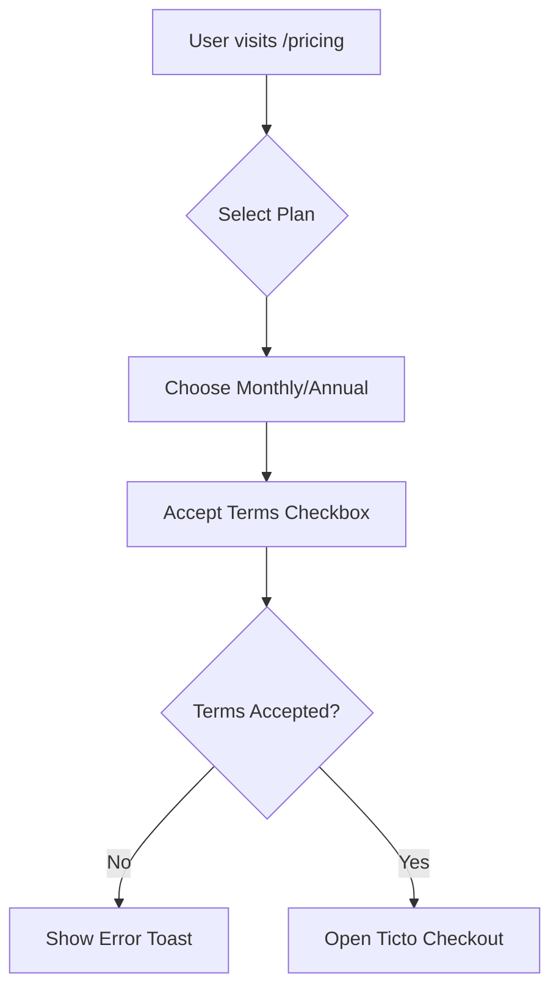

# Subscription System Documentation

## Table of Contents
- [Overview](#overview)
- [Pricing Model](#pricing-model)
- [Payment Flow](#payment-flow)
- [Architecture](#architecture)
- [Database Schema](#database-schema)
- [Webhook Integration](#webhook-integration)
- [Subscription Lifecycle](#subscription-lifecycle)
- [Dunning & Grace Periods](#dunning--grace-periods)
- [Cancellation Flow](#cancellation-flow)
- [Reconciliation](#reconciliation)
- [Email Notifications](#email-notifications)
- [Admin Tools](#admin-tools)
- [Testing](#testing)

---

## Overview

The ENP Hub platform uses a **three-tier subscription model** with recurring billing processed through **Ticto**, a Brazilian payment gateway. The system supports both monthly and annual billing cycles with automatic renewals, dunning management, and graceful handling of payment failures.

### Key Features
- 3-tier plan system (Básico, Pro, VIP)
- Monthly and annual billing cycles
- Automatic renewal with dunning management
- 7-day grace period before access revocation
- User-initiated cancellation (access until period end)
- Admin reconciliation tools
- Real-time subscription activation via Supabase Realtime
- Idempotent webhook processing
- Comprehensive audit trail

---

## Pricing Model

### Plan Tiers

| Plan | Monthly Price | Annual Price | Annual Savings | Target Audience |
|------|---------------|--------------|----------------|-----------------|
| **Básico** | R$ 0 | R$ 0 | — | Free tier with limited access |
| **Pro** | R$ 47 | R$ 470 | R$ 94 (2 months free) | Active job seekers |
| **VIP** | R$ 97 | R$ 970 | R$ 194 (2 months free) | Premium candidates |

### Feature Access by Plan

#### Básico (Free)
- 1 resume analysis/month
- Community access
- Job browsing
- **No PDF export, libraries, or premium features**

#### Pro
- 10 resume analyses/month
- Power Verbs & improvements
- PDF export
- Library & Masterclass access
- Monthly Hotseats
- Prime Jobs bookmarks
- 10% discount on services

#### VIP (Premium)
- **Unlimited resume analyses**
- All Pro features included
- Interview Cheat Sheet
- Prime Jobs (20 curated jobs/month)
- Priority in Hotseats
- 20% discount on services

### Billing Cycles
- **Monthly**: Charged on the same day each month
- **Annual**: Charged once per year, equivalent to 10 months (2 months free discount)

---

## Payment Flow

### 1. User Selects Plan



**Frontend Component**: [`PricingPage.tsx`](../src/pages/pricing/PricingPage.tsx)

- Fetches active plans from `plans` table
- Displays 3-card layout with monthly/annual toggle
- Pre-fills user email in Ticto checkout URL
- Records terms acceptance timestamp in `user_subscriptions.terms_accepted_at`

### 2. Ticto Checkout

User is redirected to Ticto's hosted checkout page in a new tab:
```
https://pay.ticto.com.br/checkout/{offer_id}?email={user_email}
```

**Offer ID Mapping**:
- Each plan has two Ticto offer IDs stored in the `plans` table:
  - `ticto_offer_id_monthly` (e.g., "123456")
  - `ticto_offer_id_annual` (e.g., "789012")

### 3. Payment Processing

Ticto processes the payment via:
- Credit card (instant)
- Pix (real-time Brazilian instant payment)
- Boleto (Brazilian bank slip, 1-3 business days)

### 4. Webhook Activation

Once payment is confirmed, Ticto sends a webhook to:
```
POST https://{project-ref}.supabase.co/functions/v1/ticto-webhook
```

**Webhook Handler**: [`ticto-webhook/index.ts`](../supabase/functions/ticto-webhook/index.ts)

```typescript
// Routing logic
if (offerId matches plans.ticto_offer_id_*) {
  // SUBSCRIPTION PATH
  handleSubscriptionEvent(payload, matchedPlan, supabase)
} else {
  // ONE-TIME PURCHASE PATH (existing hub_services logic)
  processHubServicePurchase(payload)
}
```

### 5. Real-Time Activation

**Frontend Component**: [`SubscriptionSuccess.tsx`](../src/pages/pricing/SubscriptionSuccess.tsx)

```typescript
// Supabase Realtime listener
supabase
  .channel('subscription-activation')
  .on('postgres_changes', {
    event: '*',
    schema: 'public',
    table: 'user_subscriptions',
    filter: `user_id=eq.${user.id}`
  }, (payload) => {
    if (payload.new.status === 'active') {
      navigate('/dashboard/hub')
    }
  })
```

**User Experience**:
1. User completes payment on Ticto
2. Ticto sends webhook (usually within 1-5 seconds)
3. Webhook activates subscription → `status = 'active'`
4. Frontend detects change via Realtime
5. User auto-redirected to dashboard with full access

**Fallback**: 60-second timeout shows "Processing" message if webhook delayed.

---

## Architecture

### System Components

```
┌─────────────────────────────────────────────────────────────────┐
│                         Frontend (React)                         │
├─────────────────────────────────────────────────────────────────┤
│ • PricingPage          → Plan selection & Ticto checkout        │
│ • SubscriptionPage     → Account management                      │
│ • DunningBanner        → Payment failure alerts                  │
│ • CancellationFlow     → Self-service cancel                     │
└──────────────────┬──────────────────────────────────────────────┘
                   │
                   ▼
┌─────────────────────────────────────────────────────────────────┐
│                    Supabase (Backend)                            │
├─────────────────────────────────────────────────────────────────┤
│ DATABASE:                                                        │
│ • plans                → Plan configs                            │
│ • user_subscriptions   → User subscription state                 │
│ • subscription_events  → Webhook audit log (idempotency)         │
│                                                                  │
│ RPC FUNCTIONS:                                                   │
│ • get_full_plan_access → Returns plan + features + lifecycle    │
│                                                                  │
│ EDGE FUNCTIONS:                                                  │
│ • ticto-webhook        → Payment event processor                 │
│ • cancel-subscription  → User-initiated cancel                   │
│ • reconcile-subscriptions → Cleanup overdue/expired subs         │
│ • send-subscription-email → Transactional emails                 │
└──────────────────┬──────────────────────────────────────────────┘
                   │
                   ▼
┌─────────────────────────────────────────────────────────────────┐
│                      External Services                           │
├─────────────────────────────────────────────────────────────────┤
│ • Ticto            → Payment gateway (checkout + webhooks)       │
│ • Resend           → Transactional email delivery                │
└─────────────────────────────────────────────────────────────────┘
```

### Data Flow: Subscription Activation

```
User pays on Ticto
    │
    ▼
Ticto webhook → /functions/v1/ticto-webhook
    │
    ├─ Validate token (X-Ticto-Token header)
    ├─ Match offer_id to plans table
    ├─ Check idempotency (subscription_events)
    │
    ▼
handleSubscriptionEvent()
    │
    ├─ Event: "paid" / "approved" / "authorized"
    │   └─> activateSubscription()
    │       ├─ Find user by email
    │       ├─ Calculate next_billing_date (monthly +1mo, annual +12mo)
    │       ├─ Upsert user_subscriptions:
    │       │   • status = 'active'
    │       │   • plan_id = matched plan
    │       │   • billing_cycle = 'monthly' | 'annual'
    │       │   • dunning_stage = 0 (reset)
    │       └─ Log to subscription_events (audit)
    │
    ├─ Event: "subscription_delayed"
    │   └─> handleSubscriptionDelayed()
    │       ├─ Increment dunning_stage (1 → 2 → 3)
    │       ├─ Stage 1-2: status = 'past_due'
    │       └─ Stage 3: status = 'grace_period', grace_period_ends_at = +7 days
    │
    ├─ Event: "subscription_canceled"
    │   └─> handleSubscriptionCancelled()
    │       └─ Set cancel_at_period_end = true
    │
    └─ Event: "refunded" / "chargedback"
        └─> handleSubscriptionRefund()
            └─ Immediate downgrade to 'basic', status = 'cancelled'
```

---

## Database Schema

### `plans` Table

```sql
CREATE TABLE plans (
  id TEXT PRIMARY KEY,                    -- 'basic', 'pro', 'vip'
  name TEXT NOT NULL,
  price NUMERIC NOT NULL,                 -- Monthly price
  price_annual NUMERIC,                   -- Annual price (10 months)
  monthly_limit INTEGER NOT NULL,
  theme TEXT CHECK (theme IN ('gray', 'blue', 'purple')),
  is_active BOOLEAN DEFAULT true,
  is_popular BOOLEAN DEFAULT false,

  -- Ticto Integration
  ticto_offer_id_monthly TEXT,
  ticto_offer_id_annual TEXT,
  ticto_checkout_url_monthly TEXT,
  ticto_checkout_url_annual TEXT,

  -- Feature flags (JSONB)
  features JSONB NOT NULL DEFAULT '{}'::jsonb,
  display_features TEXT[] DEFAULT '{}',
  cta_text TEXT DEFAULT 'Assinar Agora'
);
```

**Example `features` JSONB**:
```json
{
  "resume_pass_limit": 10,
  "title_translator_limit": 5,
  "job_concierge_count": 0,
  "hotseats": true,
  "library": true,
  "masterclass": true,
  "allow_pdf": true,
  "show_improvements": true,
  "prime_jobs": true,
  "discounts": {
    "base": 10,
    "consulting": 10,
    "curriculum": 10,
    "mentorship_group": 10,
    "mentorship_individual": 10
  },
  "coupon_code": "PRO10"
}
```

### `user_subscriptions` Table

```sql
CREATE TABLE user_subscriptions (
  id UUID PRIMARY KEY DEFAULT gen_random_uuid(),
  user_id UUID NOT NULL REFERENCES auth.users(id) ON DELETE CASCADE,
  plan_id TEXT NOT NULL REFERENCES plans(id),

  -- Subscription State
  status TEXT NOT NULL CHECK (status IN (
    'active', 'inactive', 'cancelled',
    'past_due', 'grace_period', 'trial'
  )),

  -- Billing
  billing_cycle TEXT CHECK (billing_cycle IN ('monthly', 'annual')),
  starts_at TIMESTAMPTZ DEFAULT now(),
  expires_at TIMESTAMPTZ,
  next_billing_date TIMESTAMPTZ,

  -- Ticto Integration
  ticto_subscription_id TEXT,
  ticto_offer_id TEXT,
  ticto_change_card_url TEXT,

  -- Dunning Management
  dunning_stage INTEGER DEFAULT 0,
  last_payment_attempt TIMESTAMPTZ,
  grace_period_ends_at TIMESTAMPTZ,

  -- Cancellation
  cancel_at_period_end BOOLEAN DEFAULT false,
  canceled_at TIMESTAMPTZ,

  -- Terms Acceptance
  terms_accepted_at TIMESTAMPTZ,
  terms_version TEXT,

  -- Timestamps
  created_at TIMESTAMPTZ DEFAULT now(),
  updated_at TIMESTAMPTZ DEFAULT now(),

  UNIQUE(user_id)
);
```

### `subscription_events` Table (Idempotency + Audit)

```sql
CREATE TABLE subscription_events (
  id UUID PRIMARY KEY DEFAULT gen_random_uuid(),
  user_id UUID REFERENCES auth.users(id) ON DELETE CASCADE,
  subscription_id UUID REFERENCES user_subscriptions(id) ON DELETE SET NULL,

  ticto_transaction_id TEXT NOT NULL,
  event_type TEXT NOT NULL,
  event_data JSONB,

  processed_at TIMESTAMPTZ DEFAULT now(),
  created_at TIMESTAMPTZ DEFAULT now(),

  UNIQUE(ticto_transaction_id, event_type)  -- Idempotency key
);
```

**Idempotency Enforcement**:
```typescript
// Before processing webhook event
const alreadyProcessed = await supabase
  .from('subscription_events')
  .select('id')
  .eq('ticto_transaction_id', transactionId)
  .eq('event_type', eventType)
  .maybeSingle();

if (alreadyProcessed) {
  return { success: true, action: 'already_processed' };
}
```

---

## Webhook Integration

### Webhook URL
```
POST https://{project-ref}.supabase.co/functions/v1/ticto-webhook
```

### Authentication

**Ticto Token Validation**:
```typescript
const receivedToken =
  payload.token ||
  req.headers.get('X-Ticto-Token') ||
  req.headers.get('Authorization')?.replace('Bearer ', '');

const expectedToken = await getApiConfig('ticto_webhook').credentials.secret_key;

if (receivedToken !== expectedToken) {
  return 401 Unauthorized;
}
```

**Token Storage**: Encrypted in `api_configs` table using pgcrypto AES-256.

### Webhook Events

#### Sale Events (Activate Subscription)
- `paid`, `completed`, `approved`, `authorized`, `venda_realizada`

**Action**: Create or renew subscription, reset dunning, set `status = 'active'`

#### Dunning Events (Payment Failure)
- `subscription_delayed`

**Action**:
- Stage 1: `status = 'past_due'`, dunning_stage = 1
- Stage 2: `status = 'past_due'`, dunning_stage = 2
- Stage 3: `status = 'grace_period'`, dunning_stage = 3, grace_period_ends_at = +7 days

**User Access**: **Retained during past_due and grace_period** (feature access continues)

#### Cancellation Events
- `subscription_canceled` → User/Admin cancellation
- `refunded`, `chargedback` → Immediate downgrade to basic

#### Log-Only Events (No Action)
- `trial_started`, `trial_ended`
- `extended`, `card_exchanged`, `uncanceled`
- `all_charges_paid`, `waiting_payment`
- `bank_slip_created`, `pix_created`, `pix_expired`

### Sample Webhook Payload

```json
{
  "status": "paid",
  "token": "ticto_secret_key_xyz",
  "item": {
    "product_id": "123",
    "offer_id": "789012",
    "product_name": "Plano Pro Anual"
  },
  "customer": {
    "name": "João Silva",
    "email": "joao@example.com",
    "doc": "12345678900"
  },
  "order": {
    "hash": "abc123def456",
    "paid_amount": 47000,
    "order_date": "2026-02-20T10:30:00Z"
  },
  "subscriptions": [
    {
      "id": "sub_xyz789",
      "interval": "monthly",
      "next_charge": "2026-03-20",
      "change_card_url": "https://ticto.com.br/change-card/sub_xyz789",
      "successful_charges": 1,
      "failed_charges": 0
    }
  ]
}
```

---

## Subscription Lifecycle

### State Diagram

```
       ┌──────────┐
  ┌───→│ inactive │ (default state, no active subscription)
  │    └──────────┘
  │         │
  │         │ payment received
  │         ▼
  │    ┌──────────┐
  │    │  active  │◄─────┐
  │    └──────────┘      │
  │         │             │
  │         │ payment     │ payment
  │         │ failed      │ recovered
  │         ▼             │
  │    ┌──────────┐      │
  │    │ past_due │──────┘
  │    └──────────┘
  │         │
  │         │ 3rd failure
  │         ▼
  │    ┌───────────────┐
  │    │ grace_period  │
  │    └───────────────┘
  │         │
  │         │ grace expires (7 days)
  │         │ OR refund/chargeback
  │         ▼
  │    ┌───────────┐
  └────│ cancelled │
       └───────────┘
            │
            │ downgrade
            ▼
       ┌──────────┐
       │  basic   │ (plan_id = 'basic')
       └──────────┘
```

### Access Control by Status

| Status | Has Access? | Next Billing? | Dunning Stage | Notes |
|--------|-------------|---------------|---------------|-------|
| `inactive` | ❌ No | N/A | 0 | Default state, no subscription |
| `active` | ✅ Yes | Scheduled | 0 | Normal state |
| `trial` | ✅ Yes | End of trial | 0 | Trial period (if implemented) |
| `past_due` | ✅ Yes | Retry attempts | 1-2 | **Access retained**, dunning alerts shown |
| `grace_period` | ✅ Yes | Final attempt | 3 | **7 days before revocation** |
| `cancelled` | ❌ No | None | 0 | Downgraded to basic |

**Important**: Users in `past_due` and `grace_period` **retain full feature access** to minimize churn and allow them to update payment methods without disruption.

---

## Dunning & Grace Periods

### Dunning Stages

**Stage 0**: Normal (no issues)

**Stage 1** (First Failure):
- Status: `past_due`
- Action: Ticto retries payment (usually within 24-48h)
- User sees: Yellow banner "Houve um problema com seu pagamento"
- Access: **Full access retained**

**Stage 2** (Second Failure):
- Status: `past_due`
- Action: Second retry attempt
- User sees: Orange banner "Segunda tentativa de cobrança falhou"
- Access: **Full access retained**

**Stage 3** (Third Failure → Grace Period):
- Status: `grace_period`
- Grace period: **7 days** from this event
- User sees: Red banner "Último aviso: acesso será suspenso em X dias"
- Access: **Full access retained until grace_period_ends_at**

**Stage 4** (Grace Expired):
- Status: `cancelled`
- Plan: Downgraded to `basic`
- Access: **Revoked** (basic tier only)

### Dunning Banner UI

**Component**: [`DunningBanner.tsx`](../src/components/subscription/DunningBanner.tsx)

**Appearance**:
- Stage 1: Yellow (amber-50 background)
- Stage 2: Orange (orange-50 background)
- Stage 3: Red (red-50 background)

**Features**:
- Dismissible for 24 hours (localStorage)
- "Atualizar Cartão" CTA → `ticto_change_card_url`
- Shows grace period end date

**Placement**: Rendered in `DashboardLayout`, appears on every page when dunning.

### Ticto Change Card URL

When a subscription enters dunning, Ticto provides a secure URL for updating payment method:
```typescript
ticto_change_card_url: "https://pay.ticto.com.br/change-card/sub_abc123"
```

This URL is:
- Stored in `user_subscriptions.ticto_change_card_url`
- Displayed in DunningBanner and SubscriptionPage
- Opens in new tab for security

---

## Cancellation Flow

### User-Initiated Cancellation

**Component**: [`CancellationFlow.tsx`](../src/components/subscription/CancellationFlow.tsx)

**3-Step Dialog**:

#### Step 1: Confirmation
- Show features user will lose
- "Manter Plano" vs "Continuar" buttons

#### Step 2: Exit Survey
- Multiple choice reasons:
  - `too_expensive` — "Muito caro para mim"
  - `not_using` — "Não estou usando o suficiente"
  - `found_alternative` — "Encontrei outra solução"
  - `missing_features` — "Faltam funcionalidades"
  - `technical_issues` — "Problemas técnicos"
  - `temporary_pause` — "Quero pausar temporariamente"
  - `other` — "Outro motivo"
- Optional feedback textarea
- Stored in `subscription_cancellation_surveys` table

#### Step 3: Success
- "Acesso até [date]" confirmation
- Reactivation CTA

### Cancellation at Period End

**Edge Function**: [`cancel-subscription/index.ts`](../supabase/functions/cancel-subscription/index.ts)

```typescript
// User can only cancel own subscription (JWT auth)
await supabase
  .from('user_subscriptions')
  .update({
    cancel_at_period_end: true,
    canceled_at: now(),
  })
  .eq('user_id', user.id);
```

**Access Timeline**:
1. User clicks "Cancelar Assinatura" → `cancel_at_period_end = true`
2. Full access continues until `expires_at` date
3. On `expires_at`:
   - Reconciliation job detects expired cancellation
   - Downgrades to `basic` plan
   - Sets `status = 'cancelled'`

**Reactivation**: User can re-subscribe anytime before `expires_at` to prevent downgrade.

---

## Reconciliation

### Purpose
Catch subscriptions that missed webhook events or fell through the cracks due to:
- Ticto webhook delivery failures
- Network issues during critical windows
- Race conditions in distributed systems

### Edge Function: `reconcile-subscriptions`

**Endpoint**: `POST /functions/v1/reconcile-subscriptions`

**Authorization**: Admin-only or service role key

**Logic**:

#### 1. Overdue Active Subscriptions → Past Due
```sql
-- Find active subs past next_billing_date (>3 days grace)
SELECT * FROM user_subscriptions
WHERE status = 'active'
  AND next_billing_date < NOW() - INTERVAL '3 days'
```
**Action**: Set `status = 'past_due'`, `dunning_stage = 1`

#### 2. Expired Grace Periods → Cancel
```sql
-- Find grace_period subs past grace_period_ends_at
SELECT * FROM user_subscriptions
WHERE status = 'grace_period'
  AND grace_period_ends_at < NOW()
```
**Action**: Downgrade to `basic`, set `status = 'cancelled'`

#### 3. Expired Cancellations → Downgrade
```sql
-- Find cancelled subs past expires_at still on premium plan
SELECT * FROM user_subscriptions
WHERE cancel_at_period_end = true
  AND status IN ('active', 'past_due')
  AND expires_at < NOW()
```
**Action**: Downgrade to `basic`, set `status = 'cancelled'`

### Invocation

**Manual Trigger** (Admin UI):
```typescript
// AdminSubscriptionHealth.tsx
const { data } = await supabase.functions.invoke('reconcile-subscriptions');
```

**Scheduled via pg_net** (not currently enabled, requires `pg_cron` extension):
```sql
-- Example: Run daily at 3 AM
SELECT cron.schedule('reconcile-subscriptions', '0 3 * * *',
  $$ SELECT net.http_post(
    'https://project.supabase.co/functions/v1/reconcile-subscriptions',
    headers := '{"Authorization": "Bearer ' || current_setting('app.service_role_key') || '"}'::jsonb
  ) $$
);
```

---

## Email Notifications

### Email Types

**Edge Function**: [`send-subscription-email/index.ts`](../supabase/functions/send-subscription-email/index.ts)

#### 1. Confirmation (`confirmation`)
**Trigger**: Subscription activated (first payment or renewal)
```typescript
await supabase.functions.invoke('send-subscription-email', {
  body: { type: 'confirmation', user_id: userId }
});
```
**Subject**: "Assinatura ativada com sucesso!"
**CTA**: "Acessar Meu Hub"

#### 2. Renewal Reminder (`renewal_reminder`)
**Trigger**: 3 days before `next_billing_date` (manual trigger or scheduled)
**Subject**: "Sua assinatura será renovada em breve"
**CTA**: "Gerenciar Assinatura"

#### 3. Payment Failure (`payment_failure`)
**Trigger**: `subscription_delayed` webhook event
**Subject**: "Problema com seu pagamento"
**CTA**: "Atualizar Cartão" (links to `ticto_change_card_url`)

#### 4. Cancellation (`cancellation`)
**Trigger**: User cancels or admin cancels subscription
**Subject**: "Cancelamento confirmado"
**Shows**: Access end date (`expires_at`)
**CTA**: "Reativar Assinatura"

### Email Service: Resend

**Configuration**: API key stored in `api_configs` table, key name: `resend_email`

**Template Format**: HTML emails with inline styles, responsive design

**From Address**: `EUA na Prática <noreply@euanapratica.com>`

### Integration Example

```typescript
// In webhook handler (activateSubscription)
await supabase.functions.invoke('send-subscription-email', {
  body: {
    type: 'confirmation',
    user_id: profile.id
  }
});
```

---

## Admin Tools

### Admin Subscription Health Dashboard

**Route**: `/admin/subscription-health`

**Component**: [`AdminSubscriptionHealth.tsx`](../src/pages/admin/AdminSubscriptionHealth.tsx)

**Features**:

#### Key Metrics Cards
- **MRR** (Monthly Recurring Revenue): Sum of active/trial/past_due/grace_period subscriptions normalized to monthly
- **Active Subscribers**: Count of `active` + `trial` statuses
- **In Dunning**: Count of `past_due` + `grace_period` statuses
- **Churn Rate**: `cancelled / (cancelled + paying) * 100`

#### Status Breakdown
Visual progress bars showing distribution:
- Active (green)
- Trial (blue)
- Past Due (amber)
- Grace Period (orange)
- Cancelled (red)
- Inactive (gray)

#### Manual Reconciliation
- "Reconciliar" button triggers `reconcile-subscriptions` edge function
- Shows results:
  - Overdue → Past Due count
  - Grace Period Expired count
  - Cancelled Expired count
  - Error list (if any)

**Access**: Admin-only (`allowedRoles: ['admin']`)

### Admin Plans Configuration

**Route**: `/admin/planos`

**Component**: [`AdminPlans.tsx`](../src/pages/admin/AdminPlans.tsx) + [`PlanCard.tsx`](../src/components/admin/plans/PlanCard.tsx)

**Configurable Fields per Plan**:
- Name, prices (monthly/annual), theme
- Active/Inactive toggle, "Popular" badge
- Feature limits (resume pass, title translator, prime jobs)
- Feature toggles (library, masterclass, hotseats, etc.)
- Discount percentages by service category
- Auto-applied coupon code
- **Ticto Offer IDs** (monthly + annual)
- **Ticto Checkout URLs** (monthly + annual)

**Usage**: Admin fills in Ticto offer IDs from Ticto dashboard, checkout URLs are auto-generated by Ticto.

---

## Testing

### Testing the Integration

#### 1. Admin Ticto Simulator

**Route**: `/admin/ticto-simulator`

**Purpose**: Send test webhook payloads to the webhook endpoint without real payments

**Payload Templates**:
- Sale event (`paid`, `approved`, `completed`)
- Delayed payment (`subscription_delayed`)
- Cancellation (`subscription_canceled`)
- Refund (`refunded`)

**Usage**:
1. Select event type
2. Fill user email and offer ID
3. Click "Send Webhook"
4. Verify `user_subscriptions` and `subscription_events` tables update correctly

#### 2. Test Scenarios

**Scenario A: New Subscription**
1. Create test Ticto offer (or use existing)
2. Add offer ID to `plans.ticto_offer_id_monthly`
3. User clicks "Assinar" on `/pricing`
4. Redirected to Ticto checkout
5. Complete test payment
6. Ticto sends `paid` webhook
7. Verify:
   - `user_subscriptions.status = 'active'`
   - `subscription_events` logged
   - User sees success page
   - Email sent (check Resend dashboard)

**Scenario B: Payment Failure (Dunning)**
1. Simulate `subscription_delayed` via Ticto Simulator
2. Verify:
   - `user_subscriptions.dunning_stage` incremented
   - Status changes to `past_due` (stage 1-2) or `grace_period` (stage 3)
   - DunningBanner appears on frontend
   - User retains access
   - Email sent

**Scenario C: Cancellation**
1. User navigates to `/dashboard/assinatura`
2. Click "Cancelar Assinatura"
3. Complete 3-step flow
4. Verify:
   - `user_subscriptions.cancel_at_period_end = true`
   - `subscription_cancellation_surveys` row inserted
   - Access continues until `expires_at`
   - Email sent

**Scenario D: Reconciliation**
1. Manually set `next_billing_date` to 5 days ago for an active subscription
2. Navigate to `/admin/subscription-health`
3. Click "Reconciliar"
4. Verify:
   - Subscription marked `past_due`
   - Processed count = 1

#### 3. Idempotency Test

Send the same webhook payload **twice** with identical `transaction_id` and `event_type`:
- First call: Processes normally
- Second call: Returns `{ success: true, action: 'already_processed' }`
- Verify only **one** row in `subscription_events` (UNIQUE constraint enforced)

### Local Development

**Run webhook locally** (requires Supabase CLI):
```bash
supabase functions serve ticto-webhook --env-file .env.local
```

**Test with curl**:
```bash
curl -X POST http://localhost:54321/functions/v1/ticto-webhook \
  -H "Content-Type: application/json" \
  -H "X-Ticto-Token: your_test_token" \
  -d '{
    "status": "paid",
    "item": { "offer_id": "789012" },
    "customer": { "email": "test@example.com" }
  }'
```

---

## Deployment Checklist

### Pre-Launch

- [ ] Run migrations in production:
  ```bash
  supabase db push
  ```
- [ ] Deploy edge functions:
  ```bash
  supabase functions deploy ticto-webhook
  supabase functions deploy cancel-subscription
  supabase functions deploy reconcile-subscriptions
  supabase functions deploy send-subscription-email
  ```
- [ ] Configure Ticto webhook URL in Ticto dashboard:
  - URL: `https://{project-ref}.supabase.co/functions/v1/ticto-webhook`
  - Events: All subscription events
- [ ] Store Ticto secret token in `api_configs`:
  ```sql
  SELECT insert_api_config(
    'ticto_webhook',
    'Ticto Webhook',
    'prod',
    '{"secret_key": "your_ticto_secret_key"}'::jsonb
  );
  ```
- [ ] Configure Resend API key:
  ```sql
  SELECT insert_api_config(
    'resend_email',
    'Resend Email',
    'prod',
    '{"api_key": "re_your_resend_key"}'::jsonb
  );
  ```
- [ ] Add Ticto offer IDs to all active plans in `/admin/planos`
- [ ] Test with Ticto sandbox mode first (if available)

### Post-Launch Monitoring

- Monitor `subscription_events` table for webhook deliveries
- Check for errors in Supabase Edge Function logs
- Review dunning funnel: Stage 1 → 2 → 3 → Cancelled conversion rates
- Track churn rate in `/admin/subscription-health`
- Set up manual reconciliation schedule (daily or weekly)

---

## Troubleshooting

### Issue: Webhook Not Processing

**Symptoms**: Payment confirmed on Ticto, but subscription not activated

**Debug Steps**:
1. Check Ticto dashboard → Webhooks → Delivery logs
2. Check Supabase Edge Function logs:
   ```bash
   supabase functions logs ticto-webhook
   ```
3. Verify token matches:
   ```sql
   SELECT credentials->>'secret_key'
   FROM api_configs
   WHERE name = 'ticto_webhook';
   ```
4. Check `subscription_events` for error entries
5. Manually trigger via Ticto Simulator with user email

### Issue: Realtime Not Updating Frontend

**Symptoms**: Subscription activated, but user stuck on "Aguardando pagamento..."

**Debug Steps**:
1. Check browser console for Realtime errors
2. Verify Supabase Realtime is enabled in project settings
3. Check RLS policies on `user_subscriptions`:
   ```sql
   -- Users should be able to SELECT their own subscription
   SELECT * FROM user_subscriptions WHERE user_id = auth.uid();
   ```
4. Fallback: 60-second timeout should show "Processando..." message

### Issue: User Has Access Despite Expired Subscription

**Symptoms**: `expires_at` passed, user still on premium plan

**Cause**: Reconciliation not run

**Solution**:
1. Navigate to `/admin/subscription-health`
2. Click "Reconciliar"
3. Verify user downgraded to `basic`
4. Set up scheduled reconciliation (daily)

### Issue: Dunning Banner Not Showing

**Debug Steps**:
1. Check `user_subscriptions.status` and `dunning_stage`
2. Check browser localStorage for dismissal: `dunning_banner_dismissed_at`
3. Verify `DunningBanner` component imported in `DashboardLayout`
4. Clear localStorage and refresh

---

## Future Enhancements

### Planned Features

1. **Trial Periods**: 7-day free trial before first charge
2. **Plan Upgrades/Downgrades**: Mid-cycle plan changes with prorated billing
3. **Pause Subscription**: Temporary hold without cancellation
4. **Annual → Monthly Conversion**: Allow billing cycle change
5. **Usage-Based Pricing**: Overage charges for resume analyses
6. **Referral Discounts**: Discount codes for referrals
7. **Scheduled Reconciliation**: Automated via `pg_cron` or external cron service
8. **Churn Prediction**: ML model to identify at-risk subscribers
9. **Retention Offers**: Automatic discount offers on cancellation intent
10. **Multi-Currency Support**: USD pricing for international users

### Technical Debt

- Add unit tests for webhook handlers (`subscriptionHandlers.ts`)
- Add E2E tests for cancellation flow
- Monitor and optimize bundle size (current: 4.2 MB)
- Add error boundaries around Realtime listeners
- Implement webhook signature validation (HMAC) if Ticto supports it

---

## Support & Resources

### Internal Documentation
- [Plan File](../C:/Users/I335869/.claude/plans/twinkly-enchanting-deer.md) — Original implementation plan
- [Migration Files](../supabase/migrations/) — All database schema changes

### External Resources
- [Ticto API Documentation](https://docs.ticto.com.br) (if available)
- [Supabase Realtime Docs](https://supabase.com/docs/guides/realtime)
- [Resend API Docs](https://resend.com/docs)

### Contact
For questions about the subscription system implementation, contact the development team or refer to the codebase documentation.

---

**Last Updated**: 2026-02-20
**Version**: 1.0
**Status**: Production Ready
